# Construction Consultant 
Preview [Construction Consultant] (Link of live web)

Construction Consultant is a site looking for visitors that want to know more about how the process of bulding for exampel a house, storehouse, apartment etc in sweden works. It is made so that the visitor can feel inspired and get good knowledge within it's easy and user friendly design, all to make sure the information neccessary for the user is only just a click away. 
Construction Consultant will also be usefull for those looking for someone with more knowledge in the building field and that are able to offer services where a person can follow along, give advice, and keep a good eye on the project itself. 
 
 Showcase
 (Show mockup)

# Navigation 
 * UX 
  * UX-Stories
  * First Time Visitor Goals
  * Returning Visitor Goals
  * Frequent User Goals
 * Strategy
  * User needs 
  * Business vision
 * Scope 
 * Structure 
 * wireframes 
    * Changes to wireframes
 * Features
    * Existing features
    * Future Features 
 * Technologies 
    * Languages
    * Libraries and online resources 
 * Testing
  * Testing plan 
 * Implementation 
 * Results
 * Bugs 
 * Deployment
 * Credits
 * Content 
 * Media 
 *

 # UX 
 The end user of this site/project can be whoever interested in knowing more about the process of building buildings in Sweden and might find it useful to have someone that has the knowledge to follow along in such a project, making sure everything works well and doesn’t go wrong. The end user of this project/site will want to find clear description of the item listed:

* Presentation of the company 
* Explenation of how the company works
* Explenation of the company vision 
* Knowledge in building consulting and what it means
* Knowledge in what type of guidance the company offer
* A easy understanding of how one can get in contact with the company

The end goal of the project is to give the user knowledge and excitement over buildings and their process as well as how the company itself provides a secure way for their potential customers projects to end with a good result.  

 ## Ux Stories
* As a user I want to learn more about what a consulting service provides.
* As a user I want to get inspired to start a constrcution project.
* As a user I want to see who is working with the company. 
* As a user I want a clear description of every service the company provides. 
* As a user i would like to clearly and easy find contact information. 

 ### First Time Visitor Goals

 * a. As a first time visitor, I want to quick and easy understand the main purpose of the site and learn more about the company itself and what it offers. 

* b. As a first time visitor, I want to find the most simple and best way to get in contact with the company referring to any questions I have or services i might want to get. 

* c. As a first time visitor, I Want a page that clearly describes how one can do to get started in a building project 

* d. As a first time visitor I want to get inspired starting a building project and get good basic knowledge in how to do so. 

### Returning Visitor Goals

* As a Returning Visitor, I want to find information necessary for upcoming questions for a beginning project act. 
* As a Returning Visitor, I want to find the best way to get in touch with the company.
* As a Returning visitor, I want to find more links to find the company in different platforms. 

### Frequent User Goals

* As a Frequent User, I want to see if there is any new information that can be usefull for a building project
* As a Frequent User, I want to find the contact information for the company. 

# Strategy
### User needs 
For me as a user the site must be accessible on mobile, tablet and all browsers. The text, information and layout sould be clear and easy to understand. The site should have simple navigation that makes me as a user comfortable directly when turning to the page by not struggeling to find the different pages of the site. As a user I want the site to make it easy for me to send a message to the company or find other contact information as well ass overall knowledge in what the company do. 

### Business vision
The main vision and purpous behind the site is to inform more people about the service the company provide and make easy access to contact infromation as well as inspiring people to actually start a building project. The company is looking for more customers and to spread the word that they exist. This done on the site by making sure for example the text on the site isn't too long, thus that might lead to confusion and people loosing interest. secondly the site makes sure to follow a structure and color scheme, more custom for the company itself so that the user also easily can recognize the style of the company and therefore hopefully won't manage to forgett the company too quickly.

# Scope
I want my users as easily as possible to get knowledge and understanding about a construction consultant more so the company's own construction consultant and find interest and inspiration to start their own building project by imagine the company as their guide in that process and feel safe with that.

# Structure
This project is a multi page website. This to provide large amount of information by dividing that into sections and pages, making sure the information won't be too overwhelming, messy and hard to understand as well as it makes it a lot easier to find the information one might be looking for. That because the pages won't need to be too long and you can quickly find what you was looking for by using the navigation bar and following the headings that helsp the user find even more easily on the site. As a user you will find 3 different pages one for introduction and first presentation known as home page, one for the companys services and vision and one for the contact infromation. As a first experience the user will find a big header with the company name clearly dislpayed, By either scrolling down or pressing the menu options on top right of the site, the user can de find mor einformation. By scrolling down in the first visit information about almost everything in the company will be provided, this in a short description guiding the user to either visit the about and contact page to know more. The pages structure are designed to keep pretty similar design, not making them too different from each other baring in minde that this then provide intuitve learning for the user.

# Wireframes 
* Original wireframes can be found <a href="images/wireframe">here</a>

### Changes to wireframes 
When it came to my wireframe for the site there wasn't much to change yet offcourse it's almost impossible to be perfect therefore after talking to my mentor Antonija Simic one change was to place my icons on the "three column section" for the "home" and "about" page to the left of the sub heading to complement it more to it's main purpouse. Secondly was to make all my icons a bit smaller so that they only are seen as a function and not neccessary a image as one might otherwise have done. Secondly on the "about" wireframe we concluded that it would be more easy if the "what we offer" section was placed as three columns beside each other instead of under each other as my thought was first. This to keep the main structure and remain with the intuitive learning for the user.   

 # Features

This website is designed to inform the user, and give them valuable understanding of what a construction consultant is, that means that each and every section to page is designed out of that concept wich I explain futher in detail down bellow.

### Existing Features

* Navigation Bar

  * The navigationbar is designed to be simple and easy to find the different pages on the site on, giving the user it a mor simple way of finding what they are looking for without not knowing on what page they are. 
  * It exists on all three pages, acts responsive by turning to a hamburger icon when using the site on smaller screens making it more easy so read the menu. 
  * Features a logo for the company, and three sections with the name Home, About, Contact that when taking the mouse over will have a small orange line under the text that helps visually see where the user is and can go on the site. 
  * The Navigation bar will remain for a while when the user scroll down the page to then stay on top of the page when the user is under the header image. Wisit the site yourself and you will understand what I mean. (Note, this will be the same for all the different pages on the site.)

  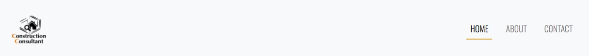

* The Home page image

  * Under the navigation bar the user will find a big interesting image as the header, as well as a big heading telling the name of the company. This to quickly tell the user where they are and to let them feel more interested in getting introduced to more information and scrooll even futher down on the page. 
  * This will remain briefly the same throughout all the pages to also make it easy for the user to understand on which page they are.

  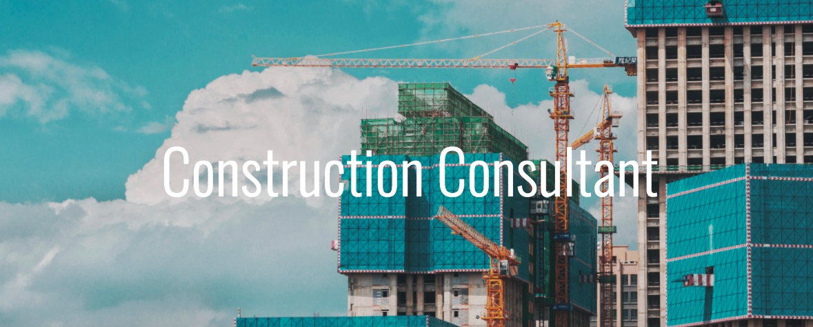  

* Introduction section
  
  * Here the user will have a short and fun description on what the company do and how the user can find out more about them. 
  * The text prompts the user to visit the different pages on the site and lastly leads to a word that is linked to the about page that can explain even further what the company does.

  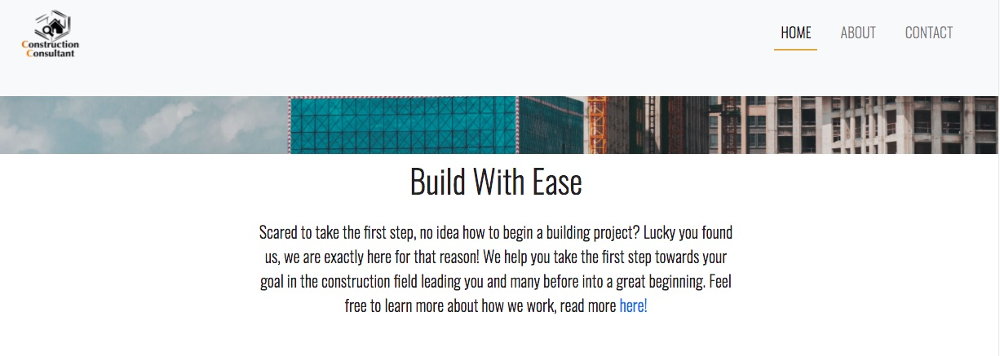  

* Our Service section

  * This section will allow the user to see all the different services the company offers and gives the visitor a brief understanding on what it does. 
  * This makes the user see the value of the company  and their services, as well as what use they might have of them in case they want to start their own building project. 
  * It features three columns that has a heading and icon beside the heading to make it easy for the user to first see the difference of the services, especially when they are moving forvard to the about page.   
 
  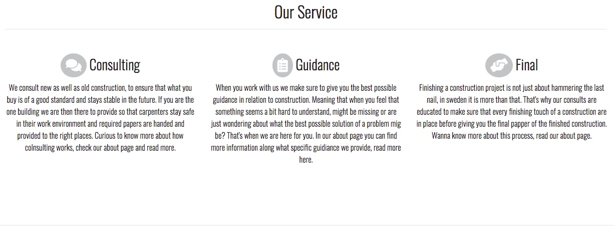 

* Our Vision section 

  * Here the user will be provided with a text explaining the vision the company have and what they strive towards to. Something to give the visitor a understanding of how they work, why they work they way they do and that the company itself want the user to be a part of thath knowledge.
  * It is created so that the user can feel more comfortable with the company, and that why the image to the right of the text is there as well. Representing how the company is there for the ones who want to build for exampel a hous and that the goal is to help them calmly begin with that. 
  
  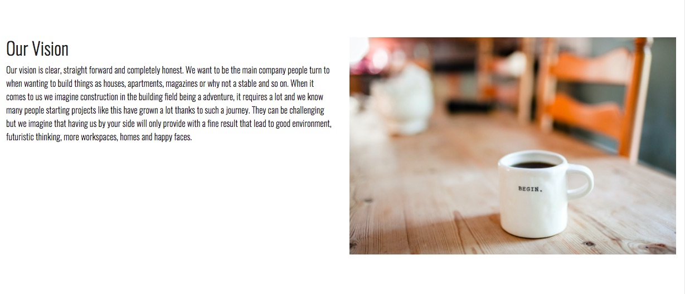 

* contact section

  * The main goal of the website is to let the company get more customers and to give potential customers to easily get in touch with the company. Therefore, a contact card is placed here with a picture of one of the employees, name, numer, email adress and a button leading to the contact page where the visitor can send a message as well. 

  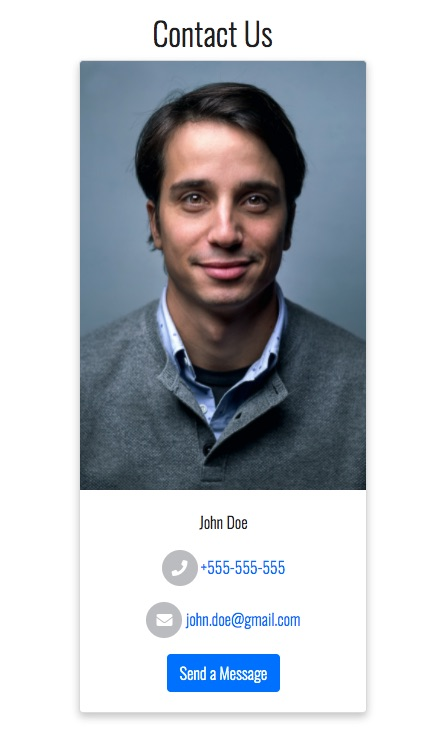 

* The Footer 

  * The footer section includes a short description of the company, icons with social media links that open on a new screen where one can find the company and get to know them even further and a extra menu to all the different pages existing on the site. 
  * The footer is valuable for the user to mostly find the company on social media as well as not needing to scroll all the way up to the top of the page to find navigation. This to make sure that the user never get's lost on the site. (Note, this remains the same for all the different pages on the site.)

  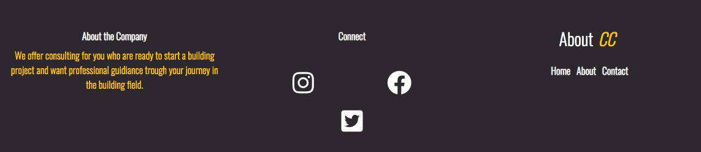 

* The About page image 
  
  * Remains with the same value as for the home page, only difference is the image and title.

* Introduction section 
 
 * This section is also a introduction to what the company is and how they see themself and what their customers to see them. This looks like on the home page, only difference is that now there isn't a word with a link to the about page. 

* Our team section 

  * A two column section with rounded images that under them has a smaller heading and some text that show and give a short presentation of the employees. 
  * Valuable for the user so that they get to know who they can come in contact with and doesn't have to feel that the person is too much of a stranger to them when first getting in touch. 

  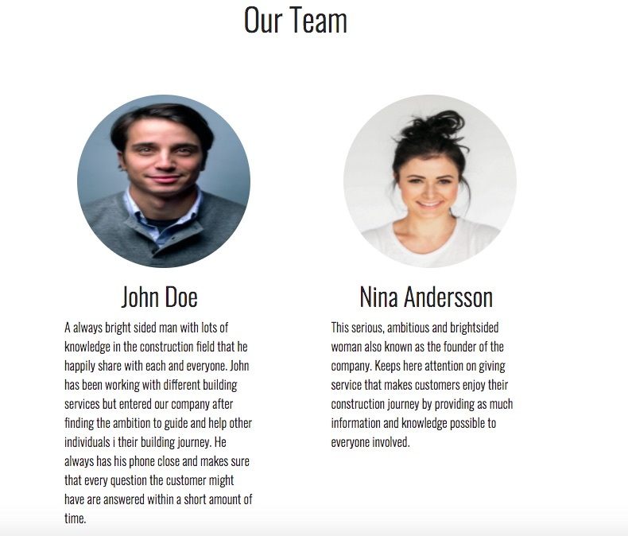 

* Our vision section

  * Two column section, to the left a heading and text, to the right a new image showing something inspiring for the user.
  * Again a section that explains the company's vision. It may seem annoying with a bit of the same information, but the basic text and image is not the same and this instead shows that the company really wants the visitor to take part in their vision so that it can constantly develop with and for its external customers. 

  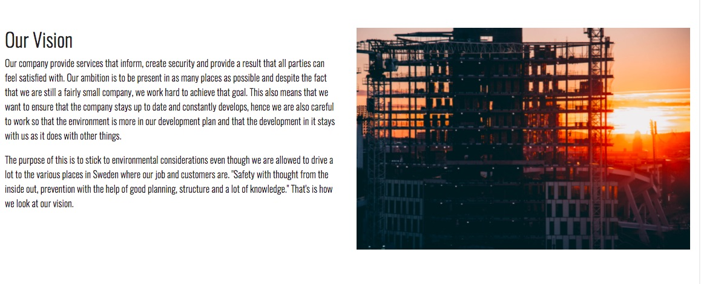 

* What We Offer section 

  * This section is looking a lot like the three column section on the homepage, yet the difference is that now there is more text explaining further about their services and what it actually is.
  * Valuable for the user so that they can feel comfortable with getting good knowledge in what the company does and how that in return can help the user of the page. 

  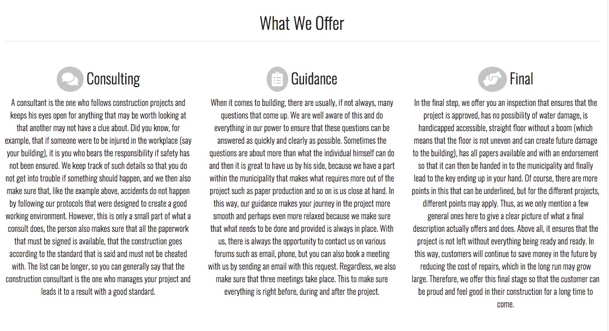 

* Find Us section
  
  * This section presents a large map for the user that shows the exact location of the company.
  * Note that there is no place that the company has so for now I have just put my hometown there, just to give something that looks presentable. This will also be the same for the contact page.  

  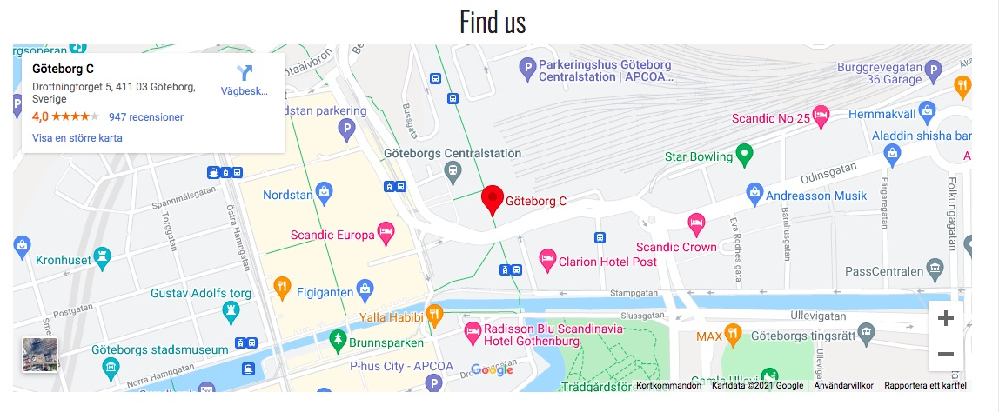 

* Contact section 
  * Same outlook and value as within the home page. 

* Footer 
  * Here also the same as with the home page.  

* The Contact page
  
  * Includes navigation bar as on the home page.
  * Includes Contact page image with text in center named contact. 
  * Includes a introduction section explaining why one should contact the company. 
  * Includes map as on the about page, containing the same address.
  * Includes footer as on the home and about page.

* Three column section 
  
  * A section that has three different icons and headings for mobile, mail and address. This to make it simple and easy for the user to find contact information.
  * Under each icon and heading is the information provided. Also clickable so that if the user want to for example take a call directly the number is already linked.

  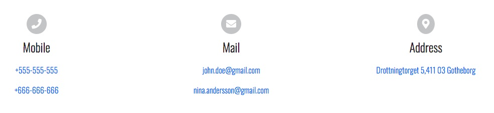 

* Send Us a Message section 
 
 * This section provides a form that the visitor can fill in to be able to from the site send a message. 
 * You can type in your name and email address and then your message. To then press the send button. At the moment the only thing that happens when you press send is that a new window will open so one manually can send a email and therefore that is one good thing to fix for the future. 

 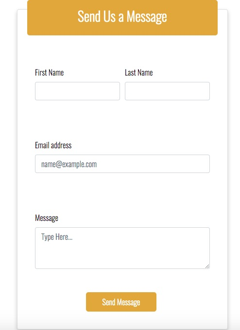 

 ### features Left to Implement 

 As for now the site can be seen as start template for a place to add more information regarding their service. There is already more features that could be implemented and you can find them all listed bellow.

 * In the future maybe more two column sections could be implemented regarding further subjects that the company would like to let their customers to know more about.  
 * Implementing programming code that can make so that the Send us a message section could be sent directly from the site. 
 * In the future maybe more people will be deployed and more people could be presented in the Our team section. 

 # Technologies 
This project was built using the following technologies

### Languages
* HTML5
* CSS 3 

### Libraries and online resources 
* Bootstrap V.4.6 used to create a responsive website, navbar, use of libraries and documentation. <a href="https://getbootstrap.com/docs/4.6/getting-started/introduction/">Bootstrap</a>
* Fontawesome for their use of icons. <a href="https://fontawesome.com/v5.15/icons/envelope?style=solid">Fontawesome</a>
* README template from code institute and github. <a href="https://github.com/Code-Institute-Solutions/readme-template">Code Institute</a> & <a href="https://guides.github.com/features/mastering-markdown/">Github</a> 
* Google fonts to have custom font specially choosen for this site known as Oswald. <a href="https://bootstrapbay.com/blog/google-web-fonts/#:~:text=Open%20sans%20is%20a%20sans%20serif%20typeface%20designed,popularity%20over%20the%20excellent%20legibility%20of%20the%20typeface.">Google fonts</a> 
* Github for it's use of saving and publishing my code <a href="https://github.com/TjoAlex/constructionconsultant">Github</a> 
* Gitpod for it's use of being able to create the existing code <a href="https://www.gitpod.io/">Gitpod</a> 

# Testing

### Testing plan 
As a beginner I have a lot to learn when it comes to testing therefore maybe my method is not the most effective but I share this to be able to further develop and learn from everything that coding means and to ensure that the testing plan has been done several times and with a critical eye so that the site doesn't have any issues. 

* Chrome Devtools 
My main goal with the layout was to make large screens have a horizontal display and on mobile devices vertical display, while on tablets or for exampel a ipad something inbetween those two. I designed the website mobile first and to do so I did extensive testing by using Chrome DevTools trough out my working process. This meant that everytime I implemneted a column with text or a image I went to the DevTools and changed settings so that I could see how it would look on for example Iphone X (with screen size 375 x 812) Iphone 6/7/8 plus (screen size 414 x 736), ipad (screen size 768 x 1024) and laptop (screen size 1440 x 900).

* Visual testing 
There might not be something named "Visual testing" yet what I mean by that is that throughout this process I have made sure to make use out of the people around me. 
  * Thanks to my dad I have a lot of knowledge within the building construction field and could therefore turn to him and some of his colleagues by asking what they would expect on a site dedicated for their type of service. This also meant that when I released a live version  of the site I made sure to share it with my dad, his colleagues and everyone else in my family to make sure it was working and looked good on their mobile devices, mostly then focusing on the layout and that the site was responsive.
  * Mentor sessions where a big help when fixing small errors of my code that I couldn't see myself. Antonija saw dirrectly small changes that had to be done and it was trough here guidiance I figured out how to center the round circle images and also fixing my bug with my navbar. 

* Validator Testing 
* HTML
  * Some errors were returned due to some typo, yet after finding them by going trough my code no errors were then returned when passing trough the official W3C validator (add link)
* CSS
  * No errors were found after passing through the official Jigsaw validator (add link)

* Testing was performed as follows: 
1. Write my code, go to Devtools to see how it looked on different screens. 
2. Sending live link of the website to people I know to see if it was working on their mobile     devices. 
3. Letting my mentor review my code and see so that it looked right. 
4. Ran my HTML code trough the W3C validator making sure there wasn't any errors or warnings. I took my code trough W3C validator first via the live version that already existed and then afterwards via direkt input of my code. 
5. Ran my CSS trough the Jigsaw validator 
6. Using Lighthouse to see the performance of the site (knowing that some of my images make the performance less good, read more about that under Unfixed Bugs)

### Bugs
Tell how you fixed haburger icon/navbar 
Tell how you fixed header image size after it went super small. 

### Unfixed Bugs
Mention not fixed bugs and why not they where fixed, you have two alex 
* contact card and 
* icons on footer as well as maybe footer not staying on the bottom, but I couldn't find that issue. 
* Mention the size of some images they are a bit big and should be compressed yet I didn't have time enough to fix that and had to set that aside for now. 
* Cricle images, they are showing very bad and doesn't look sharp, annoying as it is time was my enemy and I couldn't manage to fix that issue. 

# Deployment 
The project was made with the help of Github and Gitpod. This by creating a repository on Github to then make the code on Gitpod development workspace, that in return meant that every time i made changes to my code or added something I had to push my code to Github so that the code then was saved on the local repository. Note that before pushing my code I made sure to add git commit messages in the terminal so that I always can know what I have done in my code. 

To deploy the project I had to:
* Log in to Github and open the repository that I wanted to deploy
* Select settings, scroll down to pages section 
* Under the heading source choose master instead of none
* Make sure to save and refresh your page to confirm that the deployment is done

If you would prefer to run the project locally you should follow these steps: 
1. Log in to Github and open the repository that you wanted to deploy
2. Click on the repository then press the button code
3. There you will find Clone and Download ZIP
4. Open in your preferres IDE
5. Run your local server 

# Credits
As far as I have heard, a good developer needs to google and search a lot for answers they don't themself know the answer of. I Feel much grateful for having platforms that makes it so easy to find so much information and that's why on my list bellow there is a lot to cover, all because I want to make sure everyone that posted something helping me go futher along in my process of building this site get credit for that. This so that articles, videos and sometimes just comments on a chat redgarding this subject continues to grow and can keep helping newbies as me get valuable knowledge. 

* Bootstrap for using their grid system <a href="https://getbootstrap.com/docs/4.6/getting-started/introduction/">Bootstrap</a>
* Fontawesome for borrowing their icons <a href="https://fontawesome.com/v5.15/icons/envelope?style=solid">Fontawesome</a>
* Unsplash for borrowing some of their images <a href="https://unsplash.com/">Unsplash</a>
* The icons and all images except the one named logga.jpg aren't owned by me and is only used here for educational purpouses. 
* README template from Code Institute and Github making it a lot more easy to understand how a README file should look and how to make it look a certain way <a href="#">Code Institute</a> & <a href="https://guides.github.com/features/mastering-markdown/">Github</a> 
* Fonts google for the use of Oswald <a href="https://bootstrapbay.com/blog/google-web-fonts/#:~:text=Open%20sans%20is%20a%20sans%20serif%20typeface%20designed,popularity%20over%20the%20excellent%20legibility%20of%20the%20typeface.">Fonts google</a> 
* For image banner on top of the pages used helping code from youtube video to understand how I could make a image big and stay on top <a href="https://www.youtube.com/watch?v=HAUB4CRfOr0&list=WL&index=86">Online Tutorials</a> 
* For navigationbar used used help from code out of youtube so that I hould have a navbar that stayed on top of the page also used to get knowledge in how to create a three column section <a href="https://www.youtube.com/watch?v=9cKsq14Kfsw">Drew Ryan</a> 
* Article that helped me find design for my footer <a href="https://blog.eduonix.com/video-tutorials/web-development-tutorials/build-responsive-website-footer-using-html-bootstrap-4/">Eduonix</a> 
* info contact form section helped me find inspiration to how I could make the contact form more interesting by adding a new container that was styled with css <a href="https://www.youtube.com/watch?v=FBAfpj91hps">Pro Web</a> 
* Without too much knowledge in programming I used help from stackoverlow to fix my contact us code so it could send messages, worth mentioning is that stackowerlfow was also a helping place when i had to fix any error that occured in my code <a href="https://stackoverflow.com/questions/5773174/html-button-to-send-email">Stackoverflow</a>
* Codepen is the site that helped me write the right code to create a map for the website <a href="https://codepen.io/lowhow/pen/Xmvbdm">Codepen</a>

