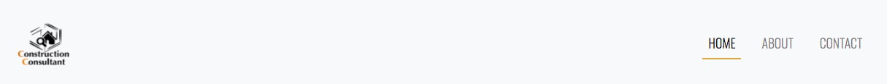
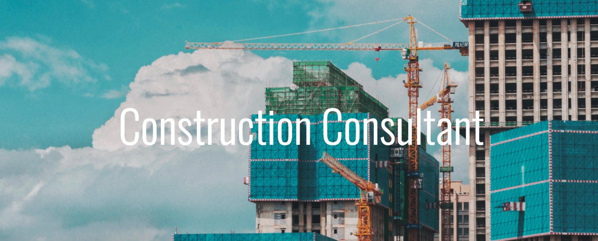
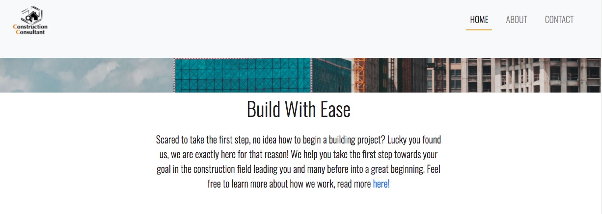
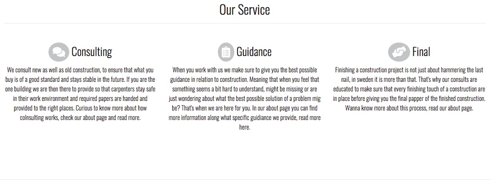
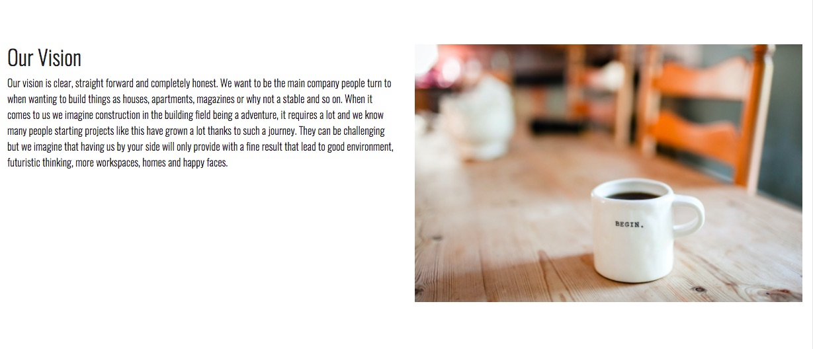
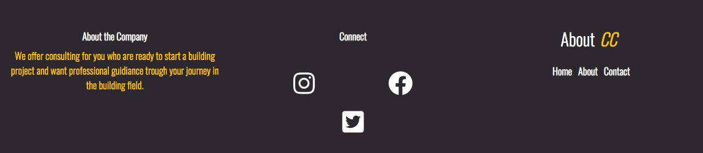
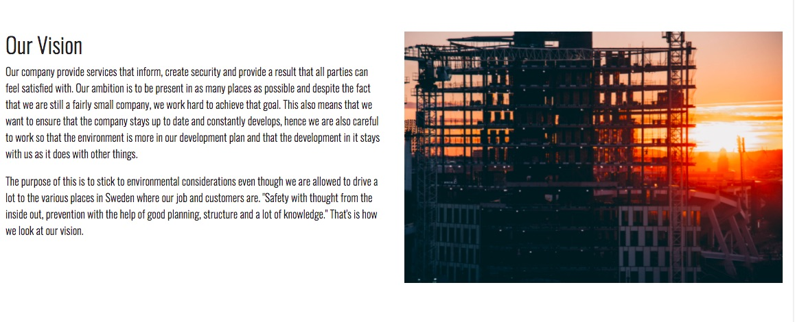
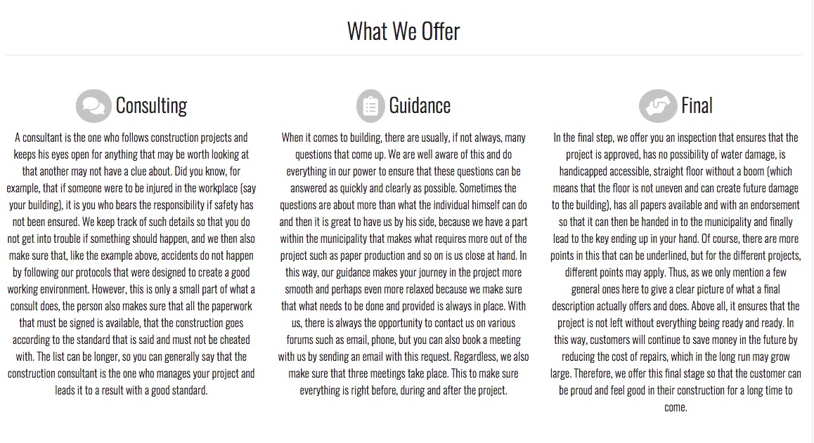
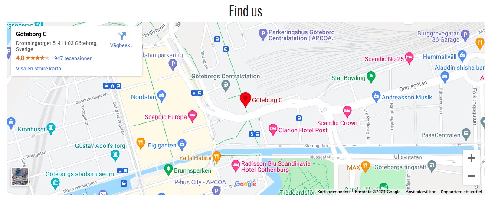

# Construction Consultant 
Preview [Construction Consultant] (Link of live web)

Construction Consultant is a site looking for visitors that want to know more about how the process of bulding for exampel a house, storehouse, apartment etc in sweden works. It is made so that the visitor can feel inspired and get good knowledge within it's easy and user friendly design, all to make sure the information neccessary for the user is only just a click away. 
Construction Consultant will also be usefull for those looking for someone with more knowledge in the building field and that are able to offer services where a person can follow along, give advice, and keep a good eye on the project itself. 
 
 Showcase
 (Show mockup)

# Navigation 
 * UX 
  * UX-Stories
  * First Time Visitor Goals
  * Returning Visitor Goals
  * Frequent User Goals
 * Strategy
  * User needs 
  * Business vision
 * Scope 
 * Structure 
 * wireframes 
    * Changes to wireframes
 * Features
    * Existing features
    * Future Features 
 * Technologies 
    * Languages
    * Libraries and online resources 
 * Testing
  * Testing plan 
 * Implementation 
 * Results
 * Bugs 
 * Deployment
 * Credits
 * Content 
 * Media 
 *

 # Features

This website is designed to inform the user, and give them valuable understanding of what a construction consultant is, that means that each and every section to page is designed out of that concept wich I explain futher in detail down bellow

### Existing Features

* Navigation Bar

  * The navigationbar is designed to be simple and easy to find the different pages on the site on, giving the user it a mor simple way of finding what they are looking for without not knowing on what page they are. 
  * It exists on all three pages, acts responsive by turning to a hamburger icon when using the site on smaller screens making it more easy so read the menu. 
  * Features a logo for the company, and three sections with the name Home, About, Contact that when taking the mouse over will have a small orange line under the text that helps visually see where the user is and can go on the site. 
  * The Navigation bar will remain for a while when the user scroll down the page to then stay on top of the page when the user is under the header image. Wisit the site yourself and you will understand what I mean. (Note, this will be the same for all the different pages on the site.)

  

* The Home page image

  * Under the navigation bar the user will find a big interesting image as the header, as well as a big heading telling the name of the company. This to quickly tell the user where they are and to let them feel more interested in getting introduced to more information and scrooll even futher down on the page. 
  * This will remain briefly the same throughout all the pages to also make it easy for the user to understand on which page they are.

    

* Introduction section
  
  * Here the user will have a short and fun description on what the company do and how the user can find out more about them. 
  * The text prompts the user to visit the different pages on the site and lastly leads to a word that is linked to the about page that can explain even further what the company does.

    

* Our Service section

  * This section will allow the user to see all the different services the company offers and gives the visitor a brief understanding on what it does. 
  * This makes the user see the value of the company  and their services, as well as what use they might have of them in case they want to start their own building project. 
  * It features three columns that has a heading and icon beside the heading to make it easy for the user to first see the difference of the services, especially when they are moving forvard to the about page.   
 
   

* Our Vision section 

  * Here the user will be provided with a text explaining the vision the company have and what they strive towards to. Something to give the visitor a understanding of how they work, why they work they way they do and that the company itself want the user to be a part of thath knowledge.
  * It is created so that the user can feel more comfortable with the company, and that why the image to the right of the text is there as well. Representing how the company is there for the ones who want to build for exampel a hous and that the goal is to help them calmly begin with that. 
  
   

* contact section

  * The main goal of the website is to let the company get more customers and to give potential customers to easily get in touch with the company. Therefore, a contact card is placed here with a picture of one of the employees, name, numer, email adress and a button leading to the contact page where the visitor can send a message as well. 

   

* The Footer 

  * The footer section includes a short description of the company, icons with social media links that open on a new screen where one can find the company and get to know them even further and a extra menu to all the different pages existing on the site. 
  * The footer is valuable for the user to mostly find the company on social media as well as not needing to scroll all the way up to the top of the page to find navigation. This to make sure that the user never get's lost on the site. (Note, this remains the same for all the different pages on the site.)

   

* The About page image 
  
  * Remains with the same value as for the home page, only difference is the image and title.

* Introduction section 
 
 * This section is also a introduction to what the company is and how they see themself and what their customers to see them. This looks like on the home page, only difference is that now there isn't a word with a link to the about page. 

* Our team section 

  * A two column section with rounded images that under them has a smaller heading and some text that show and give a short presentation of the employees. 
  * Valuable for the user so that they get to know who they can come in contact with and doesn't have to feel that the person is too much of a stranger to them when first getting in touch. 

   

* Our vision section

  * Two column section, to the left a heading and text, to the right a new image showing something inspiring for the user.
  * Again a section that explains the company's vision. It may seem annoying with a bit of the same information, but the basic text and image is not the same and this instead shows that the company really wants the visitor to take part in their vision so that it can constantly develop with and for its external customers. 

   

* What We Offer section 

  * This section is looking a lot like the three column section on the homepage, yet the difference is that now there is more text explaining further about their services and what it actually is.
  * Valuable for the user so that they can feel comfortable with getting good knowledge in what the company does and how that in return can help the user of the page. 

   

* Find Us section
  
  * This section presents a large map for the user that shows the exact location of the company.
  * Note that there is no place that the company has so for now I have just put my hometown there, just to give something that looks presentable. This will also be the same for the contact page.  

   

* Contact section 
  * Same outlook and value as within the home page. 

* Footer 
  * Here also the same as with the home page.  